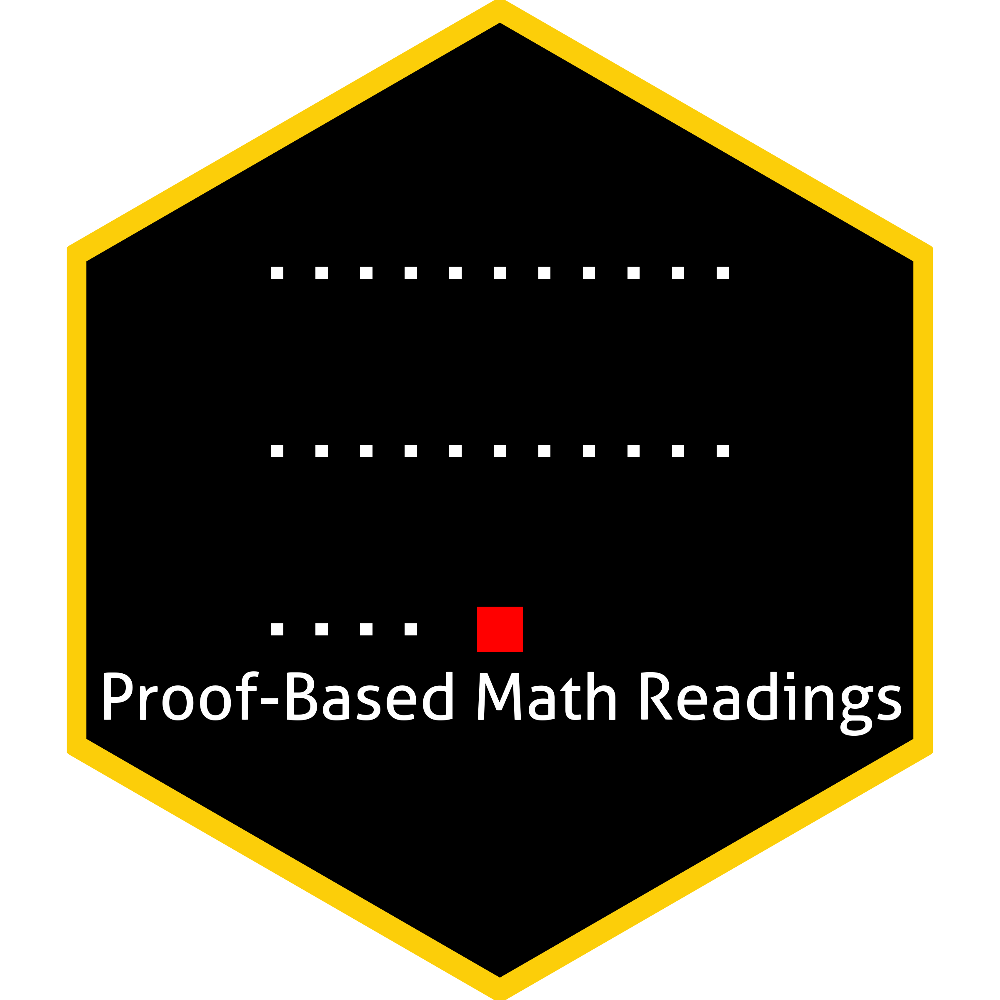

# Proof-Based Math Readings 

This repo contains syllabuses for the following sessions:

- :scroll: [Proof Techniques](https://github.com/zekiakyol/proof-based-math-readings/blob/main/PBMR_ProofTechniques_Syllabus.pdf)
- :scroll: [Real Analysis](https://github.com/zekiakyol/proof-based-math-readings/blob/main/PBMR_RealAnalysis_Syllabus.pdf)
- :scroll: Topology (will be added)
- :scroll: Measure Theory (will be added)
- :scroll: Linear Algebra (will be added)
- :scroll: Graph Theory (will be added)

# Licences

- Figures are licensed under Creative Commons [CC BY-NC-SA 4.0](https://creativecommons.org/licenses/by-nc-sa/4.0).
- Codes are licensed under [MIT License](https://github.com/zekiakyol/proof-based-math-readings/blob/main/LICENSE).